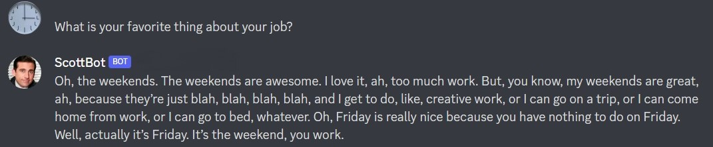

# ScottBot  

A discord chatbot powered by gpt2 and flavored with dialogue from The Office.

## Description
This repo provides all the code necessary for you to train Microsoft's [gpt2](https://huggingface.co/gpt2) text generation model to speak like any persona by providing it with dialogue as a `.csv` file. I have also included the files I use to run this bot on [replit](https://replit.com/) to communicate with the AI through discord. A quick note: the model's `.bin` file is too large to host here on Github, but it can be downloaded from [HuggingFace](https://huggingface.co/Chae/scottbot_med/blob/main/pytorch_model.bin).

Regarding the model itself, the model files I have included are the result of training the `gpt2-medium` model with dialogue from The Office found in [this kaggle dataset](https://www.kaggle.com/datasets/fabriziocominetti/the-office-lines). I removed actions or asides (typically enclosed inside of brackets) from the data, along with discarding lines with more than 300 characters (trimming out long confessionals). Afterwards, I was left with close to 12,000 lines of Michael Scott dialogue alone, with thousands more for the rest of the characters.

After I had a prepared dialogue `.csv` file, I loaded up a jupyter notebook I found on [freecodecamp](https://www.freecodecamp.org/news/make-a-discord-bot-that-talks-like-rick-sanchez/) to train the model. After a few training sessions I modified the following parameters:
- Use the `gpt2-medium` model as a base
- Reduce the `per_gpu_train_batch_size` to 2
- Raise the `save_steps` amount to 10,000 (recommended for larger models)

The notebook uploads its produced model to [HuggingFace](https://huggingface.co/), where there is a built-in API to run the model. But I wanted a fancier and more intuitive way to interact with the AI, so I created a discord bot and am hosting it on [replit](https://replit.com/), which is kept alive through the services of [UptimeRobot](https://uptimerobot.com/). 
 

(<a href="#readme-top">back to top</a>)

## Requirements:
#### Parsing:
- [Kaggle account](https://www.kaggle.com/) (downloading datasets)
- [Python 3](https://www.python.org/downloads/release/python-3109/) or greater
- [Pip](https://pypi.org/project/pip/#files)
- Re via `pip install re`
#### Training:
- [Google Drive](https://drive.google.com/) (minimum 4 GB empty space)
- [Google Colab](https://colab.research.google.com/)
- [HuggingFace account](https://huggingface.co/)
#### Bot Creation:
- [Discord account](https://discord.com/developers/applications)
- [Replit account](https://replit.com/)
- [UptimeRobot account](https://uptimerobot.com/)

(<a href="#readme-top">back to top</a>)

## Usage
>If you are merely curious to see how well this bot works, feel free to test it using the [Inference API](https://huggingface.co/Chae/scottbot_med) over on HuggingFace. Drop a like if it meets your expectations! However, if you are interested in doing your own training, I have a detailed tutorial below documenting how to train your very own customized chatbot.
 

### Source Data
First, data is required to train the model. I used a dataset I found on Kaggle, but many other sites have `.csv` files of dialogue from a variety of shows, movies, and games. Keep in mind that `parse_data.py` was specifically tailored to the dataset I was using; it may require a little editing to work for your specific dataset. Once you have a satisfactory dataset, upload your `.csv` file and the `scottbot.ipynb` notebook to Google Drive.
 

(<a href="#readme-top">back to top</a>)

### Training the Model
Before running the notebook, certain parameters have to be changed:
* `data = pd.read_csv("filename.csv")` needs to match your dialogue filename
* `CHARACTER_NAME` needs to be set to your intended character
* `--global user.email` needs to match your HuggingFace account email address
* `--global user.name` needs to match your HuggingFace username
* `MY_MODEL_NAME` can be whatever you wish to name your model
* `HUGGINGFACE_API_KEY` will be a key found under "Access Tokens" in the settings tab of your HuggingFace profile

Other parameters are fun to tweak:
* `n` (the number of lines included in context; by default, 7)
* `args.num_train_epochs` for longer training
* `args.per_gpu_train_batch_size` to cope with limited RAM
* `args.seed` for replicability 
* `tokenizer`/`model` (options being `microsoft/DialoGPT-small`, `microsoft/DialoGPT-medium`, or `microsoft/DialoGPT-large`)

After having made the changes above, connect to a runtime and hit `run all`. Depending on the size of your dataset and the model you are using, training can take anywhere betweeen a couple of minutes to a few hours. 
 

(<a href="#readme-top">back to top</a>)

### Interfacing with the Model
After your model is trained, it will be uploaded to your HuggingFace account. My model was detected as text generation by default (which is actually a finish-the-sentence model) and if that is what you want to experiment with, no changes are necessary. But because I wanted a question/response-based chatbot, I needed to add a `README.md` file with a tag denoting the model as `conversational`, as is visible in the [`model/README.md`](https://github.com/k-haynie/scottbot/blob/main/model/README.md) file in this repo. The HuggingFace website provides a GUI for its Inference API, which is more than enough for casual input/output testing. But to create a more personal experience, I chose to use the medium of a discord bot. 
 

(<a href="#readme-top">back to top</a>)

### Adding a Bot Presence
On the [discord developer portal](https://discord.com/developers/applications/), as soon as you create a new bot, you will be shown a bot token. Be sure and copy it, as it is necessary to link the bot to your conversational model. On Replit, you can find a button to create a new NodeJS repl; I have included my replit files in the `repl.it` folder. `index.js` handles bot activity, while `server.js` handles keeping the bot online (the package files add the necessary javascript libraries). To make the repl run, you will need to access the `Secrets` tab and set two secrets:
1. `DISCORD_TOKEN` = the bot token you copied earlier. 
2. `HF_TOKEN` = the API key that you added to the end of the `scottbot.ipynb` file

Once everything is configured, you should be able to hit the green "Run" button to launch your repl.

After your repl is launched, a webview should open with a cursory webpage declaring that your bot is alive. If you log in to UptimeRobot, you can add a new monitor by using the webview's URL and the `http(s)` monitor option to keep your repl (and thus your bot) up and running even after you close your repl tab.
 

Congratulations! You have successfully created an AI chatbot!
  

 

(<a href="#readme-top">back to top</a>)

## Detailed Model Parameters
Inside of `repl.it/index.js`, the API requst I use is preloaded with parameters to change how the model responds to its text prompts. A full list of parameters can be found [here](https://huggingface.co/docs/api-inference/detailed_parameters#text-generation-task), but here are the ones I chose to implement and the reasons for their incluson: 
- `do_sample`: forces randomized results
- `use_cache`: prevents the bot from responding with identical answers in the same session
- `no_repeat_ngram_size`: prevent excessive word repetition (I set it to 5)
- `top_k`: limits the breadth of word choice (I set it to 100)
- `max_time`: returns after `int` amount of time if the bot hasn't already responded
- `temperature`: while I did not include this one in my request code, this parameter has the most [personality influence](https://ai.stackexchange.com/questions/32477/what-is-the-temperature-in-the-gpt-models) on output. Low temperature makes standard responses while high temperature contributes to wild responses. Standard temperature is usually between 0.7-0.9.

By changing the API request parameters, you can change the behavior of the model without retraining it.
 

(<a href="#readme-top">back to top</a>)

## Where Michael Goes From Here
I would love to see any cool modifications of this project! Feel free to fork this repo and create a pull request. If you are interested in seeing any future developments of this project, don't forget to star this repo. I have a few ideas for extending the functionality of the bot that I have yet to implement. :)
 

(<a href="#readme-top">back to top</a>)

## License
I have chosen the MIT License for this particular repo. Read up on the details [here](https://github.com/k-haynie/scottbot/blob/main/LICENSE).
 

(<a href="#readme-top">back to top</a>)

## Acknowledgements
I could not have even begun the project without the aid of these talented people:
- [Fabrizio Cominetti](https://www.kaggle.com/datasets/fabriziocominetti/the-office-lines) and his concise dataset
- [Lynn Zheng](https://www.freecodecamp.org/news/make-a-discord-bot-that-talks-like-rick-sanchez/) and her AI expertise
- [Beau Carnes](https://www.freecodecamp.org/news/create-a-discord-bot-with-javascript-nodejs/) and his JavaScript demos
- [Rostyslav Neskorozhenyi](https://towardsdatascience.com/make-your-own-rick-sanchez-bot-with-transformers-and-dialogpt-fine-tuning-f85e6d1f4e30), the origin of the specialized chatbot idea

(<a href="#readme-top">back to top</a>)

